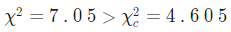

# Tugas-Statistika-Modeling
Jawab
# Uji independensi
1. Seorang dosen ingin mengetahui apakah ada hubungan antara IP mhs dengan mutu makanan mereka. Dari sampel 200 mhs diperoleh hasil sbb:
 
  
  
 
( E-O )2 /E 
   
H0: Kedua variabel independen 
H1: Kedua variabel tersebut tergantung 

Untuk a=0 .05 ,maka
P=1- a = 1-0.05=0.95	dk=( 3)-1 )×( 3)-1 )=4, 
maka daerah penolakan untuk tes ini adalah R={ χ2:x2>9.49 }.
 
   
    
=9.724+0.016+8.805+3.022+2.31+0.002+0.944+2.325+5.908 
=33.055 Karena x2=33.055 > xc2=9.488 maka H0 ditolak. 

Kesimpulan  
Dapat disimpulkan bahwa Ho ditolak. Oleh karena itu, ada cukup bukti untuk mengklaim bahwa kedua variabel itu tergantung, pada tingkat signifikansi 0,05.
Nilai p yang sesuai untuk pengujian  
  
2. Dengan melakukan survey terhadap 500 mhs, media masa kampus memperoleh tabel kontingensi tentang sikap mhs terhadap peraturan baru mengenai penggunaan gelanggang mhs: 
  
    
    
  ( E-O )2 /E 
   
Hipotesis  
H0: Kedua variabel independen 
H1: Kedua variabel tersebut tergantung 
P=1- a = 1-0.1= 0.9 	dk =( 2-1 )×( 3)-1 )=2 
maka daerah penolakan untuk tes ini adalah R={ χ2:χ2 >4.605 } 
  
   
    
   Kesimpulan 
Dapat disimpulkan bahwa hipotesis nol Ho ditolak. Oleh karena itu, ada cukup bukti untuk mengklaim bahwa kedua variabel itu tergantung, pada tingkat signifikansi 0,1.
Nilai p yang sesuai untuk pengujian  
   

 # analisis regresi linear
 
 
 
 
 

  

 
